# Integrantes
- Marcelo Godoy
- Pablo Muñoz
- Héctor Gallardo
- Ricardo Avaca

# Descripción
Proyecto desarrollado, como prueba de concepto, para la asignatura Sistemas Distribuidos de la Universidad de Santiago de Chile, a partir de una arquitectura de microservicios. 
Las historias de usuario desarrolladas, que abarcan las principales funcionalidades de una plataforma de streaming que son el streaming de video y el chat, son:
- HU-1: Como streamer, quiero poder iniciar una transmisión de video en vivo para que otros usuarios puedan ver mi contenido en tiempo real.
- HU-2: Como viewer, quiero poder visualizar una transmisión de video en vivo para disfrutar del contenido en tiempo real.
- HU-3: Como viewer, quiero poder enviar y recibir mensajes en un chat en vivo para interactuar con otros viewers durante la transmisión.
- HU-4: Como viewer, quiero poder acceder a los mensajes antiguos del chat para ver los comentarios enviados cuando no estaba conectado.

Las explicaciones de cada componente están en el informe.

# Instrucciones de despliegue
1. En primer lugar, se debe instalar docker, docker build y docker compose en la máquina en la cual se realizará la prueba de concepto (ver [Manuales Docker](https://docs.docker.com/manuals/)).
2. Una vez instalado docker, se debe acceder a cada una de las carpetas de los microservicios y utilizar el comando `docker build -t polloh/{nombre_microservicio} .` para generar las imágenes.
2. Finalmente, se debe acceder a la carpeta deployments y utilizar el comando `docker compose up -d`, para levantar todos los servicios en sus respectivos contenedores. 

"polloh" es el nombre de usuario que identifica a quién creó las imágenes, se puede reemplazar en el docker compose y luego al generarlas usar `docker build -t {nombre_usuario}/{nombre_microservicio} .`. Además, si se desea, se pueden almacenar en algún registro de contenedores como DockerHub.

# Instrucciones de uso
1. Se debe instalar una aplicación para grabación y transmisión en vivo como: OBS, Streamlabs, XSplit, Vmix, entre otros. En este caso se utiliza OBS, por lo que se recomienda hacer lo mismo (ver [Web oficial OBS](https://obsproject.com/es)).

2. Una vez instalado OBS, se debe crear una escena en el panel inferior, haciendo click en el ícono "+" y dándole un nombre a la escena.  
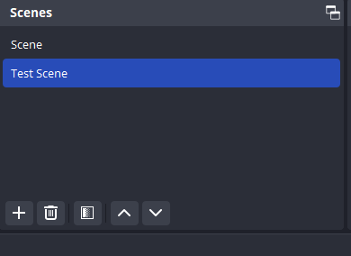  
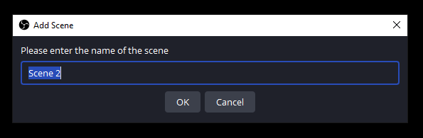  

3. Luego, se debe agregar un origen de video, en el mismo panel inferior, haciendo click en el ícono "+" y seleccionando un origen. En este caso se selecciona "Display capture", se da un nombre al origen y se configura la pantalla a mostrar.  
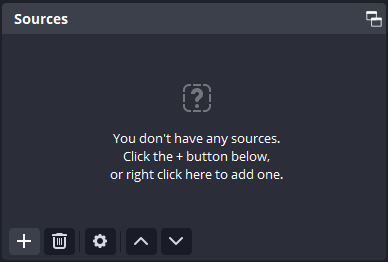  
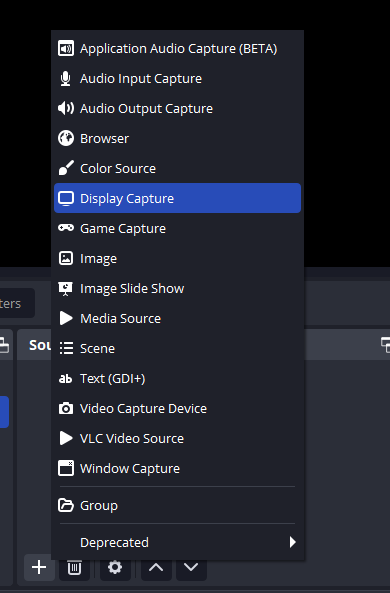  
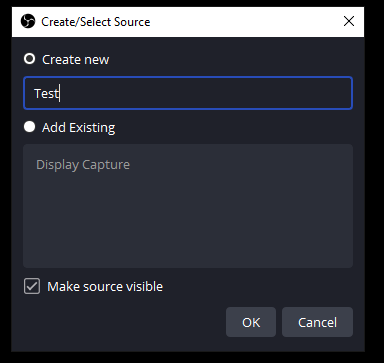  
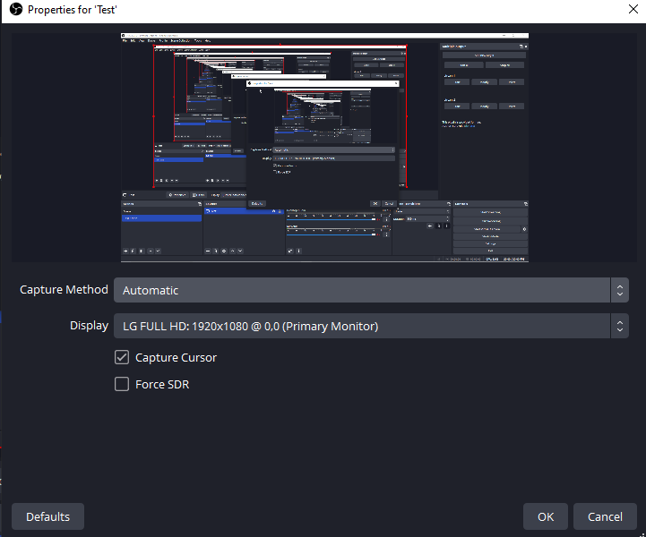  

4. Ahora, hay que ir a "File" > "Settings", y en la opción "Stream" elegir "Service" = "Custom", y en "Server" ingresar la url del servidor RTMP que se levantó con docker: rtmp://localhost:1935/app. Finalmente, en Stream Key ingresar: "stream1". Cabe destacar que el stream key, de momento, está hardcodeado en el frontend por lo cual es importante siempre poner esa stream key en específico, sin embargo, el servidor sigue aceptando múltiples conexiones rtmp, desde distintos transmisores.  
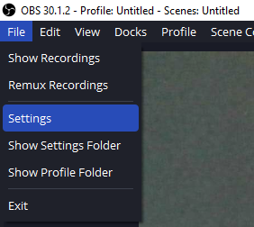  
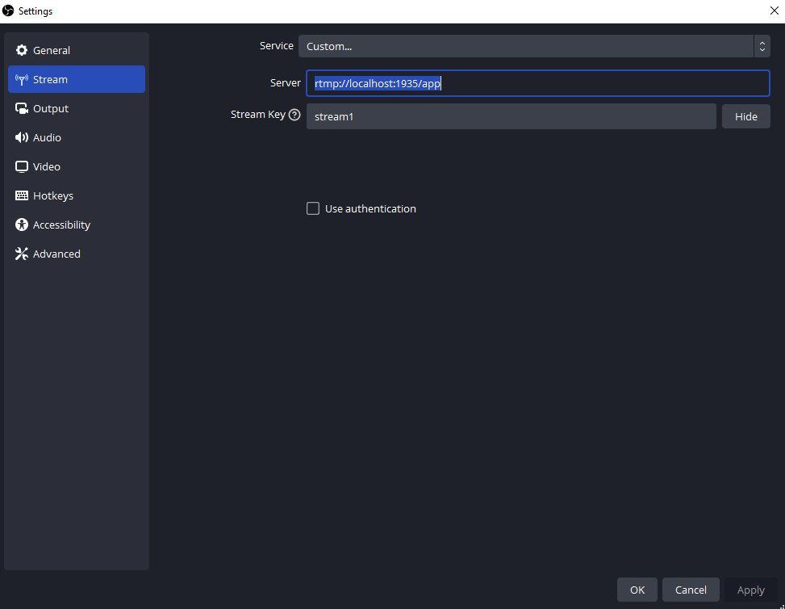  

5. Una vez configurada la transmisión, hay que apretar el botón "Start Streaming", en el panefl inferior de la derecha.  
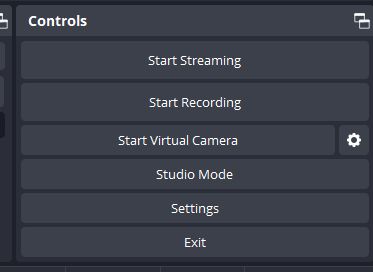  

6. Pasando al frontend, se debe acceder mediante la url http://localhost:5173 y en la esquina superior izquierda, se debe ingresar el nombre de usuario (solo hace falta escribirlo).

7. Si el stream ha iniciado, hay que esperar para que se reproduzca la emisión de video. Debido a que no existe un estricto control de errores, es recomendable iniciar el stream antes de siquiera ingresar al frontend.

8. Para enviar mensajes al chat tan ingresar el mensaje en el apartado de chat donde dice "Type your message", y luego presionar la tecla Enter o simplemente hacer click en "Send".

9. Se puede replicar la pestaña para ingresar un usuario diferente y replicar el chat, nótese que se reciben los mensajes antiguos a pesar de no haber estado conectado.  

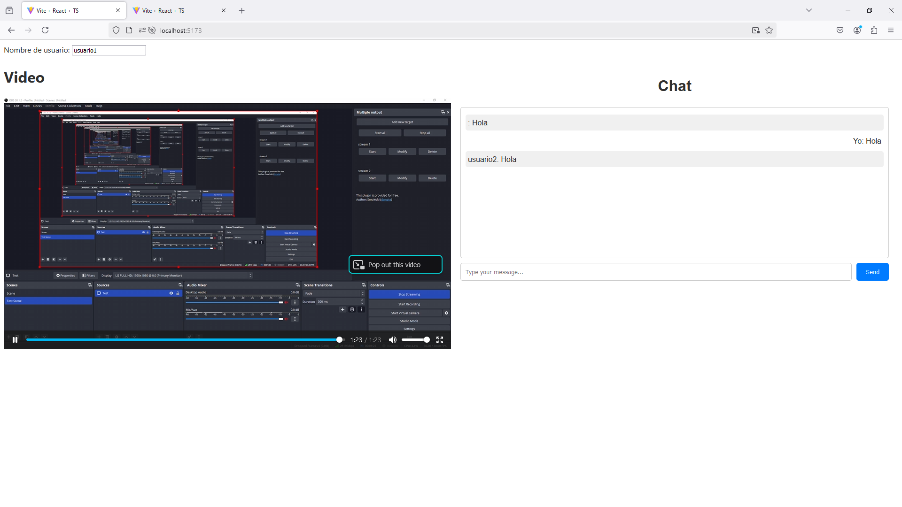  

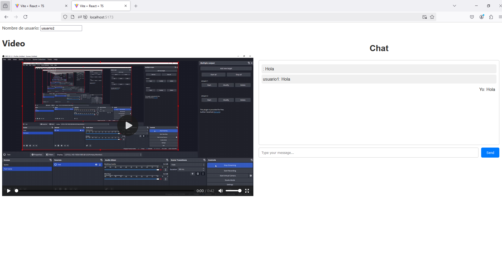  

# Tecnologías y lenguajes utilizados para el desarrollo y despliegue
- Docker 24.0.6
- Golang 1.23, 
- Node v21.4.0